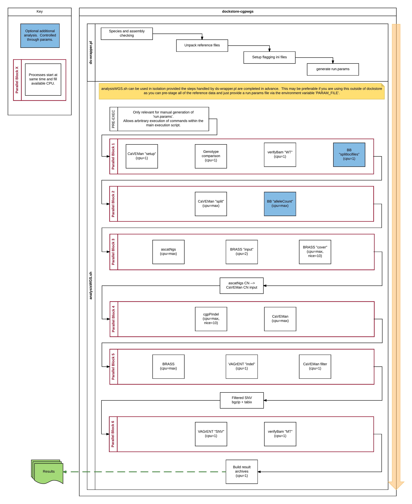

# dockstore-cgpwgs

`dockstore-cgpwgs` provides a complete multi threaded WGS analysis for SNV, INDEL, SV and Copynumber
variation with associated annotation of VCF files.  This has been packaged specifically for use with
the [Dockstore.org](https://dockstore.org/) framework.

[![Gitter Badge][gitter-svg]][gitter-badge]

[![Quay Badge][quay-status]][quay-repo]

| Master                                        | Develop                                         |
| --------------------------------------------- | ----------------------------------------------- |
| [![Master Badge][travis-master]][travis-base] | [![Develop Badge][travis-develop]][travis-base] |

## Usage

This is intended to be run using the Dockstore.org framework under docker but can be executed as a
normal docker container (or imported into singularity.

You should see the usage for the `ds-cgpwgs.pl` script for all parameters (or the `cwl` definition).

Required input files are

1. Tumour BAM file
1. Normal BAM file
1. Core reference archive (e.g. [core_ref_GRCh37d5.tar.gz][ftp-ref])
1. WXS reference archive (e.g. [SNV_INDEL_ref_GRCh37d5.tar.gz][ftp-ref])
1. WGS reference archive (e.g. [CNV_SV_ref_GRCh37d5_brass6+.tar.gz][ftp-ref])
1. VAGrENT (annotation) reference archive (e.g. [VAGrENT_ref_GRCh37d5_ensembl_75.tar.gz][ftp-ref])
1. Subclonal reference archive ([SUBCL_ref_GRCh37d5.tar.gz][ftp-ref])
  * Only needed if `skipbb` is `false`

Inputs 1&2 are expected to have been mapped using [dockstore-cgpmap][dockstore-cgpmap]

### Usable Cores

When running outside of a docker container you can set the number of CPUs via:

* `export CPU=N`
* `-cores|-c` option of `ds-cgpwgs.pl`

If not set detects available cores on system.

## Example data

The data linked in the 'examples' area is from the cell line COLO-829.

Please check the Wiki then raise an issue if you require additional information on how to generate
your own reference files.  Much of this information is available on the individual algorithm wiki
pages (or the subsequently linked protocols papers).

* [BRASS][brass-wiki]
* [cgpCaVEManWrapper][caveman-wiki]
* [cgpPindel][cgppindel-wiki]
* [ascatNgs][ascatngs-wiki]
* [VAGrENT][vagrent-wiki]

## Diagram of internals

This diagram was generated based on v1.1.0, it does not describe any of the file provisioning
handled by a Dockstore run.



## Release process

This project is maintained using HubFlow.

1. Make appropriate changes
2. Bump version in `Dockerfile` and `Dockstore.cwl`
3. Push changes
4. Check state on Travis
5. Generate the release (add notes to GitHub)
6. Confirm that image has been built on [quay.io][quay-builds]
7. Update the [dockstore][dockstore-cgpwgs] entry, see [their docs][dockstore-get-started].

## LICENCE

```
Copyright (c) 2017 Genome Research Ltd.

Author: Cancer Genome Project <cgpit@sanger.ac.uk>

This file is part of dockstore-cgpwgs.

dockstore-cgpwgs is free software: you can redistribute it and/or modify it under
the terms of the GNU Affero General Public License as published by the Free
Software Foundation; either version 3 of the License, or (at your option) any
later version.

This program is distributed in the hope that it will be useful, but WITHOUT
ANY WARRANTY; without even the implied warranty of MERCHANTABILITY or FITNESS
FOR A PARTICULAR PURPOSE. See the GNU Affero General Public License for more
details.

You should have received a copy of the GNU Affero General Public License
along with this program. If not, see <http://www.gnu.org/licenses/>.

1. The usage of a range of years within a copyright statement contained within
this distribution should be interpreted as being equivalent to a list of years
including the first and last year specified and all consecutive years between
them. For example, a copyright statement that reads ‘Copyright (c) 2005, 2007-
2009, 2011-2012’ should be interpreted as being identical to a statement that
reads ‘Copyright (c) 2005, 2007, 2008, 2009, 2011, 2012’ and a copyright
statement that reads ‘Copyright (c) 2005-2012’ should be interpreted as being
identical to a statement that reads ‘Copyright (c) 2005, 2006, 2007, 2008,
2009, 2010, 2011, 2012’."
```

<!-- links -->
[ftp-ref]: ftp://ftp.sanger.ac.uk/pub/cancer/dockstore/human
[brass-wiki]: https://github.com/cancerit/BRASS/wiki
[cgppindel-wiki]: https://github.com/cancerit/cgpPindel/wiki
[caveman-wiki]: https://github.com/cancerit/cgpCaVEManWrapper/wiki
[ascatngs-wiki]: https://github.com/cancerit/ascatNgs/wiki
[vagrent-wiki]: https://github.com/cancerit/VAGrENT/wiki

<!-- Travis -->
[travis-base]: https://travis-ci.org/cancerit/dockstore-cgpwgs
[travis-master]: https://travis-ci.org/cancerit/dockstore-cgpwgs.svg?branch=master
[travis-develop]: https://travis-ci.org/cancerit/dockstore-cgpwgs.svg?branch=develop

<!-- Gitter -->
[gitter-svg]: https://badges.gitter.im/dockstore-cgp/Lobby.svg
[gitter-badge]: https://gitter.im/dockstore-cgp/Lobby?utm_source=badge&utm_medium=badge&utm_campaign=pr-badge&utm_content=badge

<!-- Quay.io -->
[quay-status]: https://quay.io/repository/wtsicgp/dockstore-cgpwgs/status
[quay-repo]: https://quay.io/repository/wtsicgp/dockstore-cgpwgs
[quay-builds]: https://quay.io/repository/wtsicgp/dockstore-cgpwgs?tab=builds

<!-- dockstore -->
[dockstore-cgpwgs]: https://dockstore.org/containers/quay.io/wtsicgp/dockstore-cgpwgs
[dockstore-cgpmap]: https://dockstore.org/containers/quay.io/wtsicgp/dockstore-cgpmap
[dockstore-get-started]: https://dockstore.org/docs/getting-started-with-dockstore
